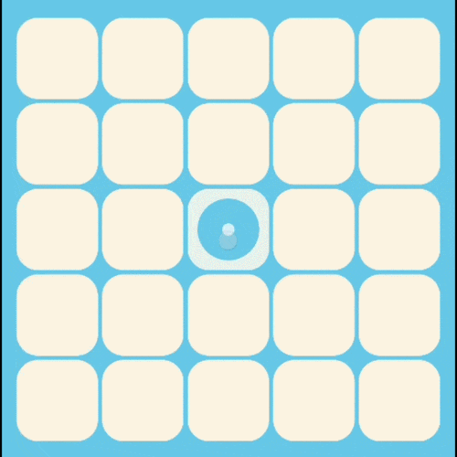
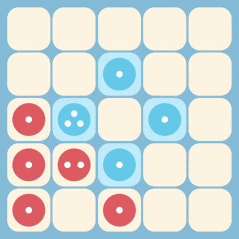
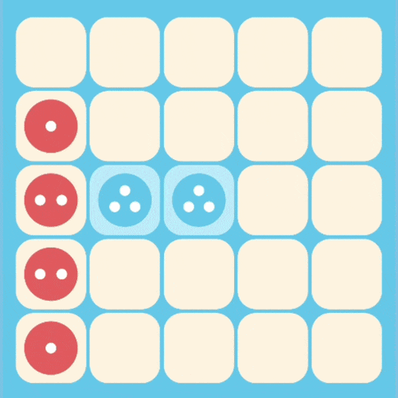

# Chain Reaction 💥

> *"One dot to rule them all... until it explodes and takes everything with it."*

A ridiculously addictive **strategy board game** for Android — tap to place dots, watch cells go **BOOM** 💣, steal your friends' territory, and be the last player standing. Simple to learn, impossible to put down.

Built with **Jetpack Compose** and **Material 3** — because even explosions deserve good design.


## 🎮 How It Works

It's deceptively simple:

1. **Tap** a cell to place a dot
2. Each cell has a **critical mass** (corners = 2, edges = 3, middle = 4)
<p align="center">
  
</p>

3. Hit critical mass? **💥 BOOM** — dots fly to neighbors and turn them your color
<p align="center">
  
</p>

4. Those neighbors might explode too... and those neighbors... and *those* neighbors...
5. One tap can flip the **entire board**. Last player alive wins!
<p align="center">
  
</p>

---


<p align="center">
  
</p>

## ✨ Features

| | Feature | Details |
|---|---|---|
| 👥 | **Local Multiplayer** | 2–6 players, one device, zero friendships spared |
| 🤖 | **VS Bot** | 3 difficulty levels — from "my grandma could beat this" to "I need therapy" |
| 📐 | **Custom Grid Sizes** | 5×5 (quick chaos) up to 10×10 (strategic warfare) |
| 💥 | **Explosion Animations** | Wave-by-wave BFS rendering — *chef's kiss* |
| 🔊 | **Sound & Music** | Satisfying taps, boomy explosions, toggleable BGM |
| 📳 | **Haptic Feedback** | Feel every explosion in your bones (toggleable) |
| 📊 | **Game Stats** | Cells captured, total moves, game duration — brag with data |
| 🔤 | **Custom Fonts** | 4 options: Default, DynaPuff, Sour Gummy, Comic Relief |
| 📖 | **How to Play** | Built-in tutorial so nobody has an excuse |
| ✨ | **Smooth Transitions** | Fade + scale animations between screens |

### 🤖 Bot Difficulty Levels

| Level | Strategy | Vibe |
|---|---|---|
| 🟢 Easy | Random moves | "Just vibing" |
| 🟡 Medium | Heuristic-based | "I've read The Art of War" |
| 🔴 Hard | Minimax + alpha-beta pruning | "I am the board" |

---

## 🛠 Tech Stack

| Layer | Technology |
|---|---|
| **UI** | Jetpack Compose, Material 3, Material Icons Extended |
| **Navigation** | Navigation Compose 2.7.7 |
| **Architecture** | ViewModel + State, Lifecycle-aware Compose |
| **AI** | Minimax with alpha-beta pruning (depth 3) |
| **Audio** | Android `MediaPlayer` / `SoundPool` |
| **Analytics** | Firebase Analytics |
| **Language** | Kotlin |
| **Min SDK** | 24 (Android 7.0) |
| **Target SDK** | 36 |

---

## 📁 Project Structure

```
app/src/main/java/com/blueedge/chainreaction/
├── ai/                  # Bot brains (Easy → Hard)
├── audio/               # Boom sounds & background vibes
├── data/                # Data models & game config
├── domain/              # The explosion engine 💣
├── ui/
│   ├── components/      # Reusable UI bits (3D buttons, etc.)
│   ├── screens/         # All the screens
│   │   ├── SplashScreen
│   │   ├── MainMenuScreen
│   │   ├── GameSetupScreen
│   │   ├── GameBoardScreen
│   │   ├── GameEndScreen
│   │   ├── SettingsScreen
│   │   └── HowToPlayScreen
│   └── theme/           # Colors, typography, theming
├── utils/               # Constants & helpers
└── MainActivity.kt      # Where the magic begins
```

---

## 🚀 Getting Started

### Prerequisites

- Android Studio Ladybug or newer
- JDK 11+
- Android SDK 36

### Build & Run

```bash
# Clone the repo
git clone https://github.com/blueedgetechno/ChainReaction.git
cd ChainReaction

# Build and install on a connected device
./gradlew installDebug

# Or build a release AAB
./gradlew bundleRelease
```

---

## 📜 License

Copyright © 2025 Blue Edge. All rights reserved.

---

<p align="center">
  Made with 💥 and probably too much coffee ☕
</p>
